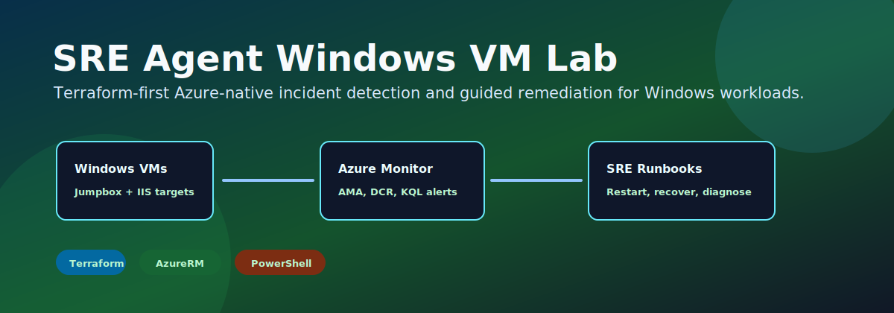

# SRE Agent Windows VM Lab

[](https://terraform.io)
[](https://registry.terraform.io/providers/hashicorp/azurerm/latest)
[](https://learn.microsoft.com/powershell/)
[](LICENSE)

<p align="center">
  
</p>

## Overview

SRE Agent Windows VM Lab is a Terraform-first Azure sandbox for practicing native incident detection and guided remediation on Windows VM workloads. It uses Azure Monitor Agent, Data Collection Rules, Log Analytics, KQL alerts, Workbooks, Azure Automation runbooks, Update Manager, Policy, and cost controls.

The lab is intentionally Azure-native: Terraform provisions the platform, Azure Monitor detects signals, and Automation runbooks perform safe lab remediation. No third-party monitoring stack is required in v1.

## Quality Review Path

| Step | Command or file | What it proves |
| --- | --- | --- |
| Lowest-cost profile | `environments/cheap-lab.tfvars` | One jumpbox, one IIS target, native monitoring, SRE runbooks, no premium network services |
| Terraform validation | `terraform fmt -check -recursive` and `terraform validate` | HCL formatting and provider schema validity |
| No-apply plan | `.\scripts\Invoke-LocalPlan.ps1 -VarFile environments/cheap-lab.tfvars` | Azure graph can be planned before creating resources |
| Script validation | `.\scripts\Invoke-SreLabValidation.ps1` | Resource groups, telemetry, alerts, AMA, and runbooks exist after deployment |
| Incident exercises | `.\scripts\Invoke-SreIncident.ps1 -Scenario IisOutage` | Lab can generate signals for alert and remediation practice |

## Architecture

<p align="center">
  
</p>

The deployment creates four main resource-group roles:

| Role | Purpose |
| --- | --- |
| `network` | Hub, management, and workload VNets, subnets, NSGs, peering, optional Firewall/VPN |
| `windows` | Jumpbox and Windows IIS incident targets |
| `sre` | Log Analytics, DCRs, alerts, Workbooks, dashboard, Automation runbooks, optional Backup |
| `governance` | Optional Azure Policy assignments and guardrail resources |

## Native SRE Flow

<p align="center">
  
</p>

1. Windows VMs run Azure Monitor Agent.
2. Data Collection Rules send performance counters, Windows events, heartbeat, IIS, and disk signals to Log Analytics.
3. Metric and KQL alerts detect CPU, VM availability, missing heartbeat, IIS outage, disk pressure, and critical Windows events.
4. Action Groups notify operators.
5. Azure Automation runbooks can restart IIS, start stopped VMs, collect diagnostics, or clean lab-safe temporary files.
6. Direct alert-to-runbook webhooks stay off by default and require `enable_alert_runbook_webhooks = true`.

## Deployment Profiles

| Profile | File | Best for | Cost posture |
| --- | --- | --- | --- |
| `cheap-lab` | `environments/cheap-lab.tfvars` | First review and low-cost demos | Lowest |
| `dev` | `environments/dev.tfvars` | Terraform and module testing | Very low |
| `lab` | `environments/lab.tfvars` | Normal SRE incident lab | Moderate |
| `full` | `environments/full.tfvars` | Expanded demo with backup and extra targets | Highest |

Start with `cheap-lab` unless you specifically need backup, Firewall, VPN, or extra Windows targets.

## Quick Start

Prerequisites:

- Azure CLI logged in with `az login`
- Terraform 1.9 or later
- Azure subscription selected with `az account set --subscription <id>` or `ARM_SUBSCRIPTION_ID`
- A private VM password supplied through `TF_VAR_admin_password` or an ignored `terraform.tfvars`

```powershell
terraform init -backend=false -reconfigure
terraform validate
.\scripts\Invoke-LocalPlan.ps1 -VarFile environments/cheap-lab.tfvars
```

For a real apply:

```powershell
terraform init
terraform apply -var-file=environments/cheap-lab.tfvars
.\scripts\Invoke-SreLabValidation.ps1 -Environment cheap-lab
```

## Master Control Panel

The main feature switches live in `terraform.tfvars` or the committed environment profiles.

```hcl
deploy_monitoring             = true
deploy_log_analytics          = true
deploy_azure_monitor_agent    = true
deploy_data_collection_rules  = true
deploy_alerts                 = true
deploy_log_query_alerts       = true
deploy_workbooks              = true
deploy_sre_agent              = true
enable_alert_runbook_webhooks = false
deploy_update_management      = true
deploy_backup                 = false
deploy_policy                 = true
deploy_cost_management        = true
deploy_windows_targets        = true
deploy_iis_farm               = true
deploy_firewall               = false
deploy_vpn_gateway            = false
```

## Lab Scenarios

<p align="center">
  
</p>

| Scenario | What you validate |
| --- | --- |
| VM health monitoring | Heartbeat, VM availability, CPU, memory, disk, and Windows event visibility |
| IIS outage | Stop W3SVC, detect service-control events, then restart IIS through a runbook |
| High CPU | Generate CPU pressure and confirm metric alert behavior |
| Disk pressure | Create a temporary lab load file and confirm disk-free-space alert behavior |
| Stopped VM | Stop a VM and validate VM availability signal plus runbook recovery |
| Diagnostics collection | Use `Collect-VMDiagnostics` to capture service, event, volume, and process snapshots |
| Update governance | Use Update Manager maintenance configs and PatchGroup tags |
| Cost guardrail | Track spend with an Azure budget on the SRE resource group |

## Testing

```powershell
terraform fmt -check -recursive
terraform init -backend=false -reconfigure
terraform validate
.\scripts\Invoke-LocalPlan.ps1 -VarFile environments/cheap-lab.tfvars
Get-ChildItem scripts -Filter *.ps1 | ForEach-Object {
  $null = [System.Management.Automation.Language.Parser]::ParseFile($_.FullName, [ref]$null, [ref]$null)
}
```

Terratest smoke tests live in `tests/` and skip live Azure checks when `ARM_SUBSCRIPTION_ID` is not set.

## Cost And Safety Notes

- Keep `enable_alert_runbook_webhooks = false` until you intentionally want alerts to invoke runbooks.
- Keep `allowed_rdp_source_ips = []` unless you have a trusted CIDR.
- Use `cheap-lab` first; `full` enables more VMs and Backup.
- Firewall, VPN Gateway, Backup storage, and Managed Grafana can materially increase cost.
- Destroy temporary deployments when finished.

## Documentation Map

- [Wiki home](wiki/README.md)
- [Architecture overview](wiki/architecture/overview.md)
- [Monitoring and dashboards](wiki/architecture/monitoring-and-dashboards.md)
- [Update management](wiki/architecture/update-management.md)
- [Variables reference](wiki/reference/variables.md)
- [Outputs reference](wiki/reference/outputs.md)
- [Pipeline](wiki/reference/pipeline.md)
