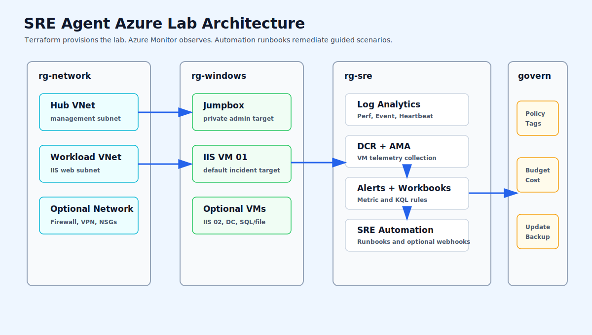
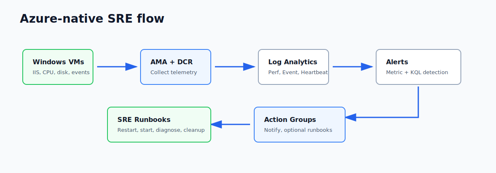
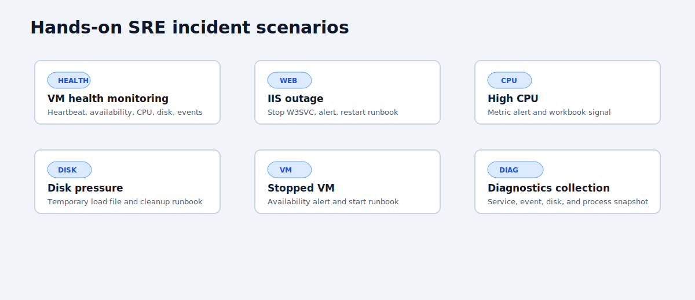

# SRE Agent Azure Lab Wiki

This wiki documents the Azure-native SRE lab: how Terraform builds Windows targets and optional app-platform services, how telemetry flows into Azure Monitor, and how guided runbooks support incident response.

## Start Here

| Step | Page | Purpose |
| --- | --- | --- |
| 1 | [Architecture overview](architecture/overview.md) | Resource groups, networks, Windows and app-platform targets, SRE resources, and guardrails |
| 2 | [Monitoring and dashboards](architecture/monitoring-and-dashboards.md) | AMA, DCR, Log Analytics, KQL alerts, Workbooks, and dashboards |
| 3 | [Update management](architecture/update-management.md) | Update Manager, PatchGroup tags, backup, policy, budgets, and runbooks |
| 4 | [Operational readiness](../docs/operational-readiness.md) | Security, reliability, cost, governance, and operations review points |
| 5 | [Variables reference](reference/variables.md) | Feature flags, VM settings, thresholds, and cost controls |
| 6 | [Pipeline](reference/pipeline.md) | GitHub Actions validation, plan, apply, smoke tests, and destroy |

## Architecture Snapshots

### SRE Lab Architecture

### Telemetry And Remediation

### Incident Scenarios

## Article Map

### Architecture

| Page | What it covers |
| --- | --- |
| [Architecture overview](architecture/overview.md) | Resource groups, network topology, Windows targets, app-platform services, SRE resources, optional add-ons |
| [Monitoring and dashboards](architecture/monitoring-and-dashboards.md) | Telemetry collection, metric alerts, KQL alerts, Workbooks, dashboards |
| [Update management](architecture/update-management.md) | Maintenance configurations, dynamic scopes, patch tags, backup, policy, budgets |
| [Operational readiness](../docs/operational-readiness.md) | Review checklist for quality gates, safety, cost, and handoff |

### Scenarios

| Page | What you validate |
| --- | --- |
| [VM health monitoring](scenarios/vm-health-monitoring.md) | Heartbeat, VM availability, CPU, disk, and Windows event visibility |
| [IIS outage](scenarios/iis-outage.md) | W3SVC failure signal and `Restart-IIS-LabTargets` remediation |
| [High CPU incident](scenarios/high-cpu-incident.md) | CPU pressure and metric alert behavior |
| [Disk pressure](scenarios/disk-pressure.md) | Free-space alerting and `Cleanup-LabDiskPressure` runbook |
| [Automation remediation](scenarios/automation-remediation.md) | Managed-identity runbooks for safe remediation |
| [Backup validation](scenarios/backup-validation.md) | Optional Recovery Services Vault protection |
| [Cost guardrail](scenarios/cost-guardrail.md) | Budget visibility on the SRE resource group |

### Reference

| Page | What it covers |
| --- | --- |
| [Variables reference](reference/variables.md) | Main inputs and feature flags |
| [Outputs reference](reference/outputs.md) | Resource IDs, endpoints, runbooks, and summary output |
| [Naming conventions](reference/naming-conventions.md) | Resource naming pattern and examples |
| [Pipeline](reference/pipeline.md) | CI/CD workflow and secrets |
| [State and secrets](reference/state-and-secrets.md) | Remote state and private VM credential guidance |

## Before You Start

- Azure subscription with Contributor access. Policy and role assignments may need elevated permissions.
- Terraform 1.9 or later locally.
- Azure CLI signed in with `az login`.
- Cost awareness: start with `cheap-lab`; AKS, App Service plans, Firewall, VPN Gateway, Backup, extra VMs, and Managed Grafana can add material cost.
- Keep `enable_alert_runbook_webhooks = false` until you intentionally want alert-triggered runbook execution.
